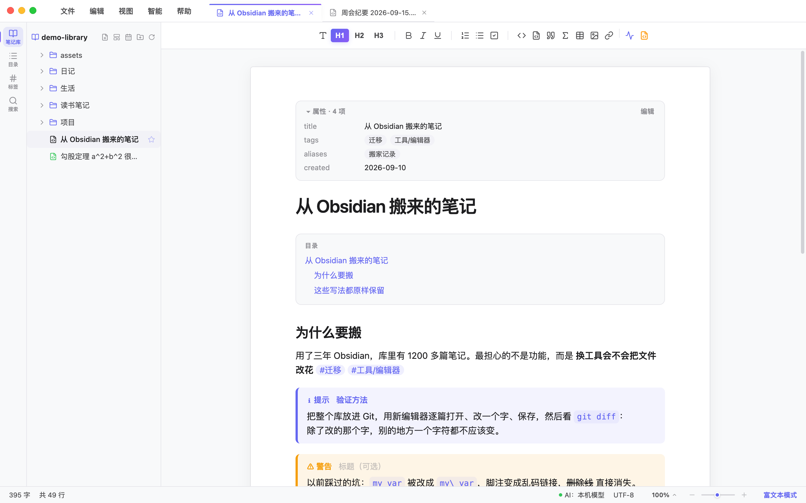
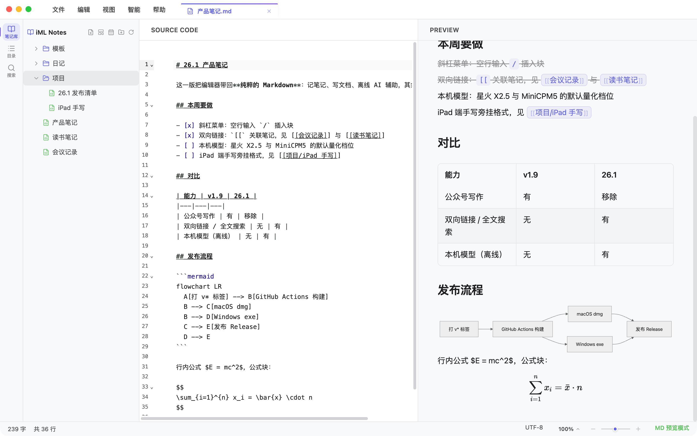

# iML Markdown Editor · [](https://github.com/imoling/iml-markdown-editor/releases)

**极简其表 · 极致内核**



---

本地 Markdown 编辑器，为长期写作和记笔记设计。界面只保留必要的东西，剩下的交给快捷键和侧边栏。

> **26.1** 起版本号改为「年份.小版本」，产品定位收敛为「纯粹的 Markdown 编辑器 + 轻量 AI 辅助」，
> 公众号写作工作站已整体移除。旧功能完整保留在 `backup/v1.9.0-before-rewrite-20260913` 分支与 v1.9.0 发布包。
> iPad 端（手写 + iCloud 共用笔记库）已起步，见 [ipad/](ipad/)。

---

## 特性

### 🎨 编辑器

- 富文本和源码两种模式，`⌘E` 切换，底层分别是 Tiptap 2.0 和 CodeMirror 6
- 查找 / 替换（`⌘F` / `⌥⌘F`），两种模式下都可用，支持区分大小写、逐个或全部替换
- Mermaid / SVG / LaTeX 公式实时渲染，图表高度可拖拽调整
- 表格、任务列表、代码高亮、图片拖拽粘贴自动存入 `assets/`
- 导出 PDF（`⌘P`），Mermaid 图表会预先渲染成静态 SVG

### ✍️ 记笔记

- **斜杠菜单**：行首输入 `/` 弹出插入菜单（标题、列表、任务、引用、代码块、表格、图片、链接、公式、Mermaid、日期、AI 助手），支持中文与拼音首字母过滤
- **双向链接**：输入 `[[` 自动补全笔记名，`[[笔记名|显示文本]]` 支持别名；点击链接打开目标，不存在则就地新建；目录面板底部显示反向链接（谁链到了这篇）
- **全文搜索**：`⌘⇧F` 搜索整个笔记库，多词 AND、标题优先、带高亮片段；点开结果直接在文档内定位
- **每日日记与模板**：`⌘⇧D` 打开今天的日记（`笔记库/日记/YYYY-MM-DD.md`）；`笔记库/模板` 下的文件可一键新建笔记，支持 `{{date}}` `{{time}}` `{{title}}` `{{weekday}}` 变量，首次使用可生成示例模板

### 📁 笔记库

- 一个文件夹就是一个笔记库：侧边栏就是这棵树，子文件夹、收藏、最近打开都在里面；宽度可拖拽
- 新建笔记 / 新建文件夹（库名右侧按钮或右键，新建在选中的文件夹里），重命名、创建副本、在访达中显示、推入废纸篓；`F2` / `⌘D` / `Backspace`
- 笔记库可以放在 iCloud Drive 或任何同步盘目录（设置 → 笔记库 → 一键"使用 iCloud Drive"）；外部改动自动刷新，未修改的标签页静默跟随磁盘，有未保存修改的标签页用橙点提示
- 库外文件（`⌘O` 或双击）只在标签页里打开，不会改变树
- 重启自动恢复标签页与展开状态；**未保存的修改也会恢复**，不会因为忘记保存而丢稿
- 可设为 `.md` 的默认打开方式（macOS「打开方式」/ Windows 文件关联），应用未开、已开但无窗口、已开有窗口三种情况都能正确显示文件

### ✨ 轻量 AI 辅助（可选）

- 空行行首按空格或 `/` 唤起 AI 气泡：续写、结合上下文补全、生成 Mermaid 流程图 / SVG 插图 / AI 图片
- 选中文本后的气泡菜单：润色（四种风格）、总结、扩写
- **本机模型（零配置离线）**：模型配置里选「本机模型」，编辑器自动下载 llama.cpp 运行时（llama-server）与推荐的 GGUF 小模型（讯飞星火 X2.5 1.7B / 4B、面壁 MiniCPM5 1B / 2B、Qwen3-4B），按本机内存与核心数标出是否满足要求；断点续传、SHA256 校验、随客户端启动、思考模式开关、上下文长度、运行日志一应俱全，请求只发往 127.0.0.1
- **接入已有的本地服务**：Ollama / LM Studio / llama.cpp 预设，无需 API Key，一键拉取模型列表
- 也兼容 OpenAI / Anthropic / DeepSeek / Gemini 及任意 OpenAI 兼容中转；推理模型的 `<think>` 块自动过滤



---

## 下载

| 平台 | 安装包 |
|---|---|
| macOS Apple Silicon（M 系列） | `iML.Markdown.Editor-x.x.x-arm64.dmg` |
| macOS Intel（x64）| `iML.Markdown.Editor-x.x.x-x64.dmg` |
| Windows | `iML.Markdown.Editor.Setup.x.x.x.exe` |

前往 [Releases](https://github.com/imoling/iml-markdown-editor/releases) 下载最新版本。

---

## 本地运行

```bash
npm install
npm run dev          # 开发模式（渲染进程的报错会转发到终端）
npm run check        # 类型检查 + ESLint + Vitest，提交前跑一遍
npm run build:mac    # macOS 安装包（同时生成 arm64 和 x64）
npm run build:win    # Windows 安装包
```

测试覆盖 Markdown ↔ HTML 往返、增量序列化、查找匹配、会话恢复与笔记库逻辑；API Key 用系统钥匙串加密存储。

---

## 技术栈

| 层 | 技术 |
|---|---|
| Core | React 19 + Vite + TypeScript |
| Runtime | Electron（Main / Preload Bridge） |
| State | Zustand（本地持久化） |
| Editor | Tiptap 2.0 / CodeMirror 6 |
| AI | OpenAI / Anthropic 协议，流式输出；本机模型由主进程托管 llama-server（llama.cpp 官方发布包 + Hugging Face GGUF，断点续传与校验），也可接 Ollama 等 OpenAI 兼容端点 |

---

## 快捷键

| 动作 | 快捷键 |
|---|---|
| 新建 / 打开 / 保存 | `⌘N` / `⌘O` / `⌘S` |
| 另存为 / 导出 PDF | `⌘⇧S` / `⌘P` |
| 切换编辑模式 | `⌘E` |
| 查找 / 查找并替换 | `⌘F` / `⌥⌘F` |
| 侧边栏显隐 / 切换笔记库 | `⌘\` / `⌘⇧O` |
| 全文搜索 / 今日日记 | `⌘⇧F` / `⌘⇧D` |
| 插入菜单 / 链接笔记 | `/` / `[[` |
| 插入链接 / 行内代码 / 删除线 | `⌘K` / `` ⌘` `` / `⌘⇧X` |
| 重命名 / 克隆 | `F2` / `⌘D` |
| 设置 / 快捷键说明 | `⌘,` / `⌘/` |

---

## 版本历史

**26.1.0（2026-09-14）** — 回归纯粹编辑器
新功能：斜杠插入菜单、双向链接与反向链接、全文搜索、每日日记与模板；`$$` 公式块可以往返保存。版本号改为「年份.小版本」。移除公众号写作工作站及联网搜索、微信发布等附属功能。"工作区"与"笔记库"合并为一个概念，侧边栏即笔记库树，支持新建笔记 / 文件夹、在访达中显示；笔记库目录监听外部改动；设置里一键把笔记库放进 iCloud Drive。新增 iPad 端骨架（SwiftUI + PencilKit，未编译验证）与手写旁挂文件格式规范。工程质量：引入 Vitest（94 个用例）与 ESLint；富文本模式改为按块增量序列化；TiptapEditor 拆成工具栏、气泡菜单、对话框、AI 钩子等模块；内联样式收口为 CSS 类；CSP 去掉 unsafe-eval，Mermaid 改 antiscript，预览与 SVG 块经 DOMPurify 净化，API Key 经 safeStorage 加密落盘。新增查找替换、侧边栏拖拽调宽、`⌘P` 导出、`⌘K` 链接。模型配置、图片生成配置、全局设置、关于、快捷键改为主窗口内的浮层，不再新开窗口（Dock / 调度中心里只有一个窗口）。首次安装或升级后自动展示「新特性介绍」，帮助菜单里可随时再看。修复：未命名文档的静默保存改为等有正文后再按第一行命名（AI 生成中、空文档或只有符号时不落盘，避免出现 `$$.md`、时间戳这类文件名）；双击 .md 文件应用启动却不显示文件；打开子目录文件时工作区被挪到子目录；关闭最后一个标签页或新建文档时文件树消失；重启丢失未保存修改；`⌘E` / `⌘⇧S` 与编辑器内建快捷键冲突；`⌘H` 被 macOS 系统占用导致替换无法唤起；Dock 图标缺少系统标准留白显得偏大。模型配置按「企业中转站 / 网络模型服务 / 本地模型 / 本机模型」四类组织：本地模型预设（Ollama / LM Studio / llama.cpp）与模型列表拉取；本机模型由编辑器自动安装 llama-server 运行时、下载并校验推荐的 GGUF 模型（星火 X2.5、MiniCPM5、Qwen3），支持导入本地 GGUF、随客户端启动、思考模式、上下文长度、运行日志、测试连接。

**v1.9.0** — 公众号写作全链路升级
新增场景写作工作流（从脑暴出发，支持网页链接 / 文档参考素材注入）。两套工作流共同升级：结构诊断、传播优化、排版预览。润色完成后可一键写回当前文档。推理模型 `<think>` 块自动过滤。

**v1.8.0** — Skill 化 AI 写作 & 公众号工作站
AI 写作重构为 Skill 体系。首发公众号热点写作 Skill。新增独立笔记库 Tab。支持 macOS 文件关联。

**v1.7.0** — Knowledge Base
深度文件管理：侧边栏右键菜单、星标收藏与访问记录。全局会话持久化。新增毛玻璃 Dashboard 启动页。

**v1.6.0** — Windows 支持 & 图形引擎
首次支持 Windows 平台。新增 AI 生成 Mermaid / SVG 图，修复 PDF 导出时图形丢失问题。

**v1.5.0** — AI 写作助手
引入场景化 AI 面板。AI 请求迁移至 Electron 主进程。全站 Indigo-Purple 视觉重设计。新增自动检查更新。

**v1.0.0** — 首发
双模编辑（Tiptap 富文本 + CodeMirror Markdown）、侧边栏目录与文件导航、PDF 导出、macOS 原生体验。

---

## 许可证

[CC BY-NC 4.0](https://creativecommons.org/licenses/by-nc/4.0/) — 非商业使用。
